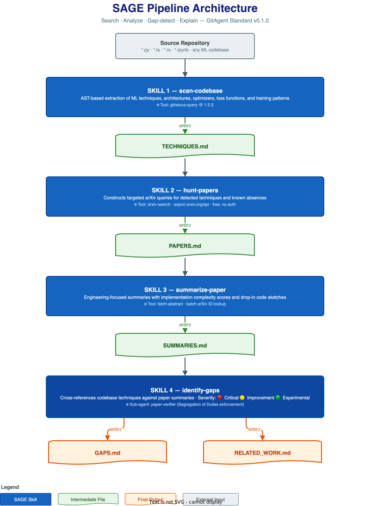

# SAGE — ML Research Intelligence Agent

<div align="center">



[](LICENSE)
[](https://github.com/open-gitagent/gitagent)
[](https://python.org)
[](https://console.groq.com)
[](https://huggingface.co/spaces/guglxni/SAGE-GitAgent-Demo)
[](https://hackculture.dev)

**Every ML project drifts from the cutting edge. SAGE is the agent that pulls it back.**

[**Live Demo →**](https://huggingface.co/spaces/guglxni/SAGE-GitAgent-Demo) · [**GitHub**](https://github.com/guglxni/SAGE-GitAgent) · [**Contributing**](CONTRIBUTING.md) · [**Security**](SECURITY.md)

</div>

---

## What is SAGE?

SAGE (**S**earch · **A**nalyze · **G**ap-detect · **E**xplain) is a framework-agnostic, git-native AI agent that bridges the gap between your ML code and the academic literature.

You point it at any ML repository. It reads your codebase, searches arXiv for relevant papers, produces engineering-focused summaries, and then hands you a structured gap report — telling you exactly what techniques you're using, what the state-of-the-art says, and what you're missing.

All outputs are markdown files committed directly to your repo.

```
TECHNIQUES.md   ← what your code is doing right now
PAPERS.md       ← what the literature says about those techniques
SUMMARIES.md    ← engineering summaries with code sketches
GAPS.md         ← 🔴 Critical · 🟡 Improvement · 🟢 Experimental gaps
RELATED_WORK.md ← LaTeX-ready bibliography section
```

---

## The Problem It Solves

ML engineers write code, ship models, and iterate — but rarely have time to systematically survey the literature. The result:

- Using SGD when AdamW + warmup is standard practice
- Missing gradient clipping that causes training instability
- A paper published 3 months ago solves exactly the bottleneck you've been debugging
- Hours spent on arXiv when the search could be grounded in your actual code

SAGE automates all of this, and it runs in under 3 minutes.

---

## Architecture

### Pipeline


### How it Works

SAGE runs a 4-step sequential pipeline, each step building on the last:

| Step | Skill | Tool | Output |
|------|-------|------|--------|
| 1 | `scan-codebase` | `gitnexus-query` (AST) | `TECHNIQUES.md` |
| 2 | `hunt-papers` | `arxiv-search` (arXiv API) | `PAPERS.md` |
| 3 | `summarize-paper` | `fetch-abstract` (batch lookup) | `SUMMARIES.md` |
| 4 | `identify-gaps` | `paper-verifier` (sub-agent SOD) | `GAPS.md` + `RELATED_WORK.md` |

**Segregation of Duties (SOD):** Critical gaps require independent verification by the `paper-verifier` sub-agent before they appear in `GAPS.md`. This prevents hallucinated paper IDs from reaching the final report.

---

## Quick Start

### Option 1: Try it Now (No Install)

Visit the live demo on HuggingFace Spaces:

**[https://huggingface.co/spaces/guglxni/SAGE-GitAgent-Demo](https://huggingface.co/spaces/guglxni/SAGE-GitAgent-Demo)**

Paste any public GitHub ML repo URL, add a free [Groq API key](https://console.groq.com/keys), and hit Run. Results in under 3 minutes.

### Option 2: Run Locally via gitclaw

**Prerequisites:** Node.js, `uv` (Python package manager)

```bash
# 1. Clone SAGE into (or alongside) your target ML project
git clone https://github.com/guglxni/SAGE-GitAgent.git sage-agent

# 2. Install dependencies
cd sage-agent
uv sync --all-groups
uv pip install -e .

# 3. Set your LLM provider key
export GROQ_API_KEY=gsk_...        # Groq (free, recommended)
# OR: export OPENAI_API_KEY=sk-...
# OR: export ANTHROPIC_API_KEY=sk-ant-...

# 4. Run SAGE against your project
npx gitclaw --dir /path/to/your-ml-project \
  --prompt "Run the full SAGE pipeline: scan the codebase, hunt arXiv papers, summarize them, and identify implementation gaps."
```

### Option 3: One-Click Dev Environment

Click **Code → Create codespace on main** on this repo's GitHub page. The `.devcontainer` configuration pre-installs all dependencies — just export your API key and run.

---

## Output Example

Running SAGE against [karpathy/minGPT](https://github.com/karpathy/minGPT) produces:

**TECHNIQUES.md** detects:
- GPT decoder-only transformer (`model.py:L12-L45`)
- AdamW optimizer with weight decay (`trainer.py:L58`)
- Cosine annealing with warmup (`trainer.py:L91`)
- Mixed precision (conditional, `trainer.py:L110`)

**GAPS.md** identifies (excerpt):
```
### 🔴 Missing Gradient Clipping
Paper: [2310.01848] Gradient Clipping Revisited
File:  trainer.py:L78-L95
Impact: Training instability on long sequences without clip_grad_norm_
Fix:   2 lines before optimizer.step() — Low complexity
```

---

## GitAgent Standard Compliance

SAGE is fully compliant with the [open GitAgent standard v0.1.0](https://github.com/open-gitagent/gitagent):

| File | Purpose |
|------|---------|
| `agent.yaml` | Agent manifest — name, version, model preferences, skills, tools |
| `SOUL.md` | Agent identity and values — who SAGE is and what it cares about |
| `RULES.md` | Hard constraints — what SAGE is never allowed to do |
| `DUTIES.md` | Segregation of Duties policy — paper-verifier sub-agent requirements |
| `skills/*/SKILL.md` | 4 skills with YAML frontmatter, execution steps, I/O specs |
| `tools/*/` | 3 tools with OpenAPI YAML schemas and Python implementations |
| `knowledge/` | Runtime knowledge base (ML taxonomy, arXiv categories, severity guide) |

---

## Model Support

SAGE works with any major LLM provider:

| Provider | Recommended Model | Notes |
|----------|------------------|-------|
| **Groq** | `meta-llama/llama-4-scout-17b-16e-instruct` | Free tier, fast — recommended |
| Groq | `llama-3.3-70b-versatile` | Fallback |
| OpenAI | `gpt-4o` | Requires paid key |
| Anthropic | `claude-sonnet-4-6` | Requires paid key |
| Custom | Any OpenAI-compatible endpoint | Set `GITCLAW_MODEL_BASE_URL` |

---

## Repository Structure

```
SAGE-GitAgent/
├── agent.yaml              # GitAgent manifest
├── SOUL.md                 # Agent identity
├── RULES.md                # Hard constraints
├── DUTIES.md               # Segregation of Duties policy
├── AGENTS.md               # Framework-agnostic run instructions
├── skills/
│   ├── scan-codebase/SKILL.md
│   ├── hunt-papers/SKILL.md
│   ├── summarize-paper/SKILL.md
│   └── identify-gaps/SKILL.md
├── tools/
│   ├── arxiv-search.{yaml,py}
│   ├── fetch-abstract.{yaml,py}
│   └── gitnexus-query.{yaml,py}
├── agents/
│   └── paper-verifier/     # SOD verification sub-agent
├── knowledge/
│   ├── ml-techniques-taxonomy.md
│   ├── arxiv-categories.md
│   └── severity-classification-guide.md
├── src/sage/               # Python tool implementations
├── hf-space-demo/          # HuggingFace Space (Streamlit + Docker)
├── docs/diagrams/          # Architecture diagrams (draw.io + SVG)
├── tests/                  # Unit + integration tests
├── examples/               # Good and bad output calibration
└── workflows/              # YAML workflow definitions
```

---

## Non-Goals

SAGE deliberately does **not**:
- Modify your source code (advisory only — you implement the fixes)
- Parse full paper PDFs (arXiv abstracts are sufficient for gap analysis)
- Require API keys for the arXiv tools (fully public, no auth)
- Send your source code to any external service (only query strings leave your machine)

---

## Built With

- [GitAgent Standard](https://github.com/open-gitagent/gitagent) — open agent specification
- [gitclaw](https://github.com/open-gitagent/gitclaw) — runtime orchestration
- [GitNexus](https://www.npmjs.com/package/gitnexus) — AST knowledge graph
- [arXiv API](https://info.arxiv.org/help/api/) — free academic paper search
- [uv](https://github.com/astral-sh/uv) — Python environment management
- [Streamlit](https://streamlit.io) — HuggingFace Space frontend

---

## Contributing

See [CONTRIBUTING.md](CONTRIBUTING.md) for development setup, contribution areas, and the PR process.

## Security

See [SECURITY.md](SECURITY.md) for the threat model, vulnerability reporting, and what data leaves your machine.

## License

[MIT License](LICENSE) — Copyright (c) 2026 Aaryan Guglani
